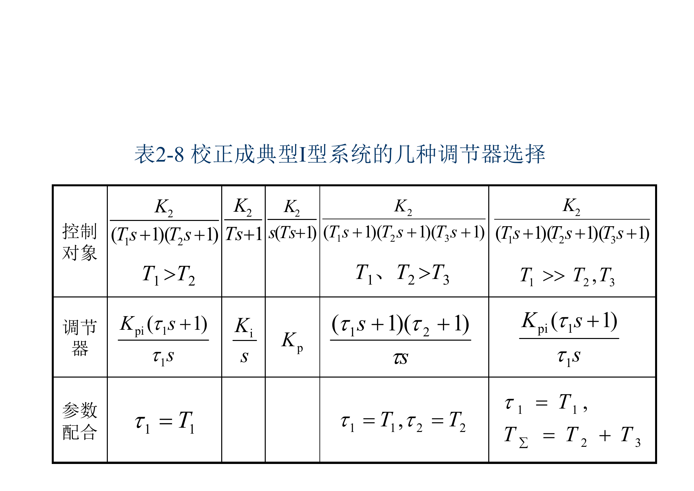
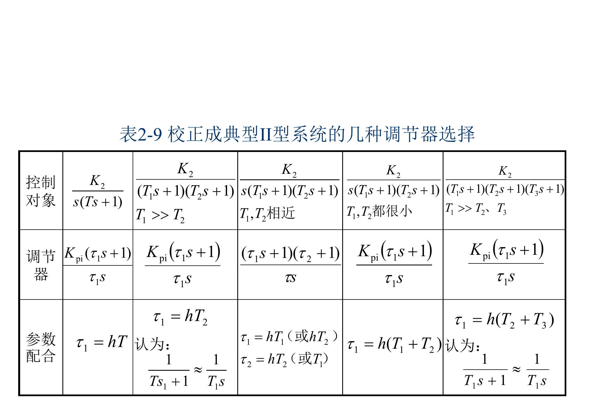

> 本文是根据课程课件与课堂记录整理的复习笔记；原始 PDF 已在“运动控制系统：原始课件”页面提供。页码以本地 PDF 页码为准。

# 运动控制系统复习重点总结

## 一句话总览

这门课的核心是：用电力电子装置调节电机供电，用反馈控制改善稳态和动态性能。直流部分重点是“闭环 + PI + 双闭环工程设计”，交流部分重点是“转差功率分类 + VVVF + PWM + 矢量控制/DTC”。

## 按课件页码定位重点

| 优先级 | 内容 | 对应课件页码 | 典型考法 |
|---|---|---|---|
| A | 双闭环结构、ASR/ACR、恒流起动、起动三阶段 | 第2章 pp. 4-16, 40-58 | 画图、简答、波形分析 |
| A | 双闭环工程设计：典型 I/II 型、表2-8/表2-9、电流环/转速环 | 第2章 pp. 71-164 | 计算、设计步骤、参数选择 |
| A | 调速范围、静差率、闭环静特性、PI 无静差 | 第1章 pp. 118-152, 244-283 | 计算、简答 |
| A | VVVF 基频以下/以上、恒压频比、磁通控制 | 第6章 pp. 4-14, 20-49 | 简答、判断、机械特性分析 |
| A | PWM/SVPWM、转差频率控制、矢量控制、DTC | 第6章 pp. 115-263, 391-469 | 对比题、简答题 |
| B | V-M/PWM 直流电源、V-M 系统问题 | 第1章 pp. 12-113 | 对比题 |
| B | 交流调速按转差功率分类、变压调速效率问题 | 第5章 pp. 21-87 | 分类题、简答题 |
| C | 绪论定义、分类、发展趋势、负载特性 | 绪论 pp. 7-17, 24-31 | 概念题 |

## 最高频主线

1. 直流调速以调压调速为主。
2. 单闭环转速负反馈能减小静差，但比例控制不能消除静差。
3. PI调节器依靠积分作用实现无静差。
4. 双闭环系统用 ASR 控转速、ACR 控电流，起动时可近似恒流升速。
5. 交流调速按转差功率可分为消耗型、馈送型、不变型。
6. VVVF 是交流调速重点，基频以下恒转矩，基频以上恒功率。
7. 矢量控制通过坐标变换实现磁链和转矩解耦。
8. DTC 直接控制定子磁链和电磁转矩，响应快但有转矩脉动。

## 必背公式与关系

### 直流电机转速方程

$$
n = \frac{U - IR}{K_e \Phi}
$$

推出三种调速：

- 改变 $U$：调压调速，主方法。
- 改变 $R$：调阻调速，有级、损耗大、机械特性变软。
- 改变 $\Phi$：弱磁调速，基速以上小范围升速。

### 调速范围与静差率

$$
D = \frac{n_{\max}}{n_{\min}}
$$

$$
s = \frac{\Delta n_N}{n_0}
$$

$$
D = \frac{n_N s}{\Delta n_N (1 - s)}
$$

理解点：静差率按最低速考核；静差率越小、额定速降越大，允许调速范围越小。

### 闭环减小速降

$$
\Delta n_{\mathrm{cl}} = \frac{\Delta n_{\mathrm{op}}}{1 + K}
$$

理解点：负反馈能压低被反馈环包围的前向通道扰动，但不能消除给定和反馈检测误差。

### PWM平均电压

$$
\rho = \frac{t_{\mathrm{on}}}{T}
$$

$$
U_d = \rho U_s
$$

双极性可逆PWM可让平均电压在正负范围内连续变化，适合可逆运行。

### VVVF磁通关系

$$
E_g = 4.44 f_1 N_s k_{N_s} \Phi_m
$$

$$
\frac{E_g}{f_1} = \mathrm{constant} \Rightarrow \Phi_m = \mathrm{constant}
$$

$$
\frac{U_s}{f_1} \approx \mathrm{constant}
$$

上式是工程上常用的近似恒磁通控制。

低频时要做定子电阻压降补偿。

## 0. 复习内容编号总表

| 编号 | 模块 | 必须掌握到什么程度 |
|---:|---|---|
| 0 | 绪论 | 会定义运动控制系统，会按负载特性判断调速方案 |
| 1 | 单闭环直流调速 | 会算 $D$、$s$、$\Delta n_N$，会解释PI无静差 |
| 2 | 双闭环直流调速 | 会画结构、说清 ASR/ACR、起动三阶段、工程设计 |
| 5 | 交流拖动与变压调速 | 会按转差功率分类，会解释降压调速低效 |
| 6 | 变压变频调速 | 会解释 $U/f$、PWM、坐标变换、矢量控制、DTC |

建议优先级：第2章 > 第6章 > 第1章 > 第5章 > 绪论。

## 1. 直流调速公式库

### 1.1 电机基本方程

电枢电压方程：

$$
U=E+IR
$$

反电动势：

$$
E=K_e\Phi n
$$

转速方程：

$$
n=\frac{U-IR}{K_e\Phi}
$$

电磁转矩：

$$
T_e=K_t\Phi I
$$

机械运动方程：

$$
T_e-T_L=J\frac{d\omega}{dt}
$$

### 1.2 静态指标

调速范围：

$$
D=\frac{n_{\max}}{n_{\min}}
$$

静差率：

$$
s=\frac{\Delta n_N}{n_0}
$$

调速范围、静差率、额定速降关系：

$$
D=\frac{n_Ns}{\Delta n_N(1-s)}
$$

闭环速降：

$$
\Delta n_{\mathrm{cl}}=\frac{\Delta n_{\mathrm{op}}}{1+K}
$$

### 1.3 PWM与PI

占空比：

$$
\rho=\frac{t_{\mathrm{on}}}{T}
$$

不可逆PWM平均电压：

$$
U_d=\rho U_s
$$

双极性PWM平均电压：

$$
U_d=(2\rho-1)U_s
$$

PI调节器：

$$
W_{\mathrm{PI}}(s)=K_p+\frac{K_i}{s}
=K_p\frac{\tau s+1}{\tau s}
$$

## 2. 双闭环公式库

### 2.1 反馈关系

转速反馈：

$$
U_n=\alpha n
$$

电流反馈：

$$
U_i=\beta I_d
$$

正常稳态：

$$
n=\frac{U_n^*}{\alpha}
$$

$$
I_d=\frac{U_i^*}{\beta}
$$

最大电流：

$$
I_{dm}=\frac{U_{im}^*}{\beta}
$$

### 2.2 起动过程

恒流升速阶段：

$$
I_d\approx I_{dm}
$$

$$
\frac{d\omega}{dt}
=\frac{K_t\Phi I_{dm}-T_L}{J}
$$

所以转速近似线性上升：

$$
\omega(t)\approx \omega(0)+
\frac{K_t\Phi I_{dm}-T_L}{J}t
$$

### 2.3 工程设计

典型I型：

$$
W_I(s)=\frac{K}{s(Ts+1)}
$$

典型II型：

$$
W_{II}(s)=\frac{K(\tau s+1)}{s^2(Ts+1)}
$$

记忆：

1. 电流环：典型I型，快速跟随，限流，抑制电网扰动。
2. 转速环：典型II型，抗负载扰动，稳态无静差。
3. 设计顺序：先电流环，后转速环。

### 2.4 表2-8与表2-9必须会看

第2章工程设计不是只背“电流环典型I型、转速环典型II型”，还要会根据控制对象选择调节器。课件表2-8和表2-9就是这一部分的总表。

表2-8用于把对象校正成典型I型。最常见考法是：对象有两个惯性环节，其中 $T_1>T_2$，则用PI调节器：

$$
W_R(s)=\frac{K_{pi}(\tau_1s+1)}{\tau_1s}
$$

并令：

$$
\tau_1=T_1
$$

含义是用PI的零点抵消对象中较大的惯性环节，剩下积分环节和小惯性环节，整理成典型I型。

表2-9用于把对象校正成典型II型。转速环常按典型II型设计，因为它更重视抗负载扰动。若存在特别大的惯性环节，常用近似：

$$
\frac{1}{Ts+1}\approx \frac{1}{Ts}
$$

这样可以把大惯性近似为积分环节，配合PI调节器形成典型II型结构。

## 3. 交流调速公式库

### 3.1 异步电机转速关系

同步转速：

$$
n_0=\frac{60f_1}{n_p}
$$

实际转速：

$$
n=(1-s)n_0
$$

转差率：

$$
s=\frac{n_0-n}{n_0}
$$

转差频率：

$$
f_s=sf_1
$$

### 3.2 转差功率

转子铜耗：

$$
P_{\mathrm{Cu2}}=sP_{\mathrm{em}}
$$

机械功率：

$$
P_m=(1-s)P_{\mathrm{em}}
$$

转差功率：

$$
P_s=sP_{\mathrm{em}}
$$

### 3.3 变压调速

异步电机转矩近似与电压平方成正比：

$$
T_e\propto U_s^2
$$

最大转矩：

$$
T_{\max}\propto U_s^2
$$

风机泵类负载：

$$
T_L\propto n^2
$$

$$
P_L\propto n^3
$$

## 4. 变压变频公式库

### 4.1 磁通控制

气隙电动势：

$$
E_g=4.44f_1N_sk_{N_s}\Phi_m
$$

恒磁通条件：

$$
\frac{E_g}{f_1}=\mathrm{constant}
$$

工程近似：

$$
\frac{U_s}{f_1}\approx \mathrm{constant}
$$

低频补偿的原因：

$$
U_s\approx E_g+I_sR_s+jX_sI_s
$$

### 4.2 坐标变换

Clarke变换：

$$
\begin{bmatrix}
i_\alpha\\
i_\beta
\end{bmatrix}
=
\frac{2}{3}
\begin{bmatrix}
1 & -\frac{1}{2} & -\frac{1}{2}\\
0 & \frac{\sqrt{3}}{2} & -\frac{\sqrt{3}}{2}
\end{bmatrix}
\begin{bmatrix}
i_a\\
i_b\\
i_c
\end{bmatrix}
$$

Park变换：

$$
\begin{bmatrix}
i_d\\
i_q
\end{bmatrix}
=
\begin{bmatrix}
\cos\theta & \sin\theta\\
-\sin\theta & \cos\theta
\end{bmatrix}
\begin{bmatrix}
i_\alpha\\
i_\beta
\end{bmatrix}
$$

### 4.3 矢量控制与DTC

转子磁链定向：

$$
\psi_{rq}=0,\qquad \psi_r=\psi_{rd}
$$

矢量控制转矩关系：

$$
T_e=K_T\psi_r i_{sq}
$$

DTC定子磁链估算：

$$
\psi_{s\alpha}=\int(u_{s\alpha}-R_si_{s\alpha})\,dt
$$

$$
\psi_{s\beta}=\int(u_{s\beta}-R_si_{s\beta})\,dt
$$

DTC转矩估算：

$$
T_e=\frac{3}{2}n_p(\psi_{s\alpha}i_{s\beta}-\psi_{s\beta}i_{s\alpha})
$$

## 章节考点

### 绪论

重点掌握：

- 运动控制系统定义：电动机为对象，控制器为核心，电力电子功率变换装置为执行机构。
- 分类：调速/伺服，直流/交流，模拟/数字，单环/双环/多环。
- 交流调速发展趋势：交流电机结构简单、维护少，但高性能控制依赖电力电子和控制算法。

常问法：

- 为什么先学直流调速？
- 为什么交流调速逐渐取代直流调速？
- 调压、调阻、调磁三种直流调速方式怎么比较？

### 第1章：单闭环直流调速

重点掌握：

- 三类可控直流电源：G-M、V-M、PWM。
- V-M系统的问题：单向导电、对过压过流敏感、谐波和无功、电流脉动。
- PWM系统优点：低速好、范围宽、响应快、效率高、功率因数好。
- 调速范围、静差率、额定速降的关系。
- 转速负反馈如何减小转速降落。
- 比例控制有静差，PI控制无静差。
- 电流截止负反馈只在电流超过临界值后起限流作用。

易错点：

- 闭环能减小静差，不代表比例闭环能消除静差。
- 反馈只能抑制反馈环包围的扰动。
- “无静差”是稳态意义，不是动态过程不发生速降或超调。

### 第2章：双闭环直流调速

重点掌握：

- 系统结构：ASR外环，ACR内环，ASR输出是电流给定。
- ASR输出限幅决定最大电流。
- 起动三阶段：电流上升、恒流升速、转速调节。
- ASR饱和时：转速环相当于开环，电流环起主要作用。
- ASR不饱和时：转速闭环起作用，系统转速无静差。
- ACR作用：快速电流跟随、限流、抑制电网电压扰动。
- ASR作用：转速稳定、抗负载扰动。
- 工程设计：先电流环后转速环；电流环典型I型，转速环典型II型；调节器多用PI。

常问法：

- 为什么双闭环可以获得接近理想的起动过程？
- 为什么起动过程会出现转速超调？
- 电流环和转速环各自抗什么扰动？
- 为什么内环要比外环快？

### 第5章：交流拖动与变压调速

重点掌握：

- 交流调速三类：转差功率消耗型、馈送型、不变型。
- 降压调速属于转差功率消耗型，低速效率低。
- VVVF属于转差功率不变型，效率高，应用广。
- 变压调速改变的是定子电压，最大转矩近似与电压平方成正比。
- 普通异步电机变压调速范围窄，适合风机泵类负载。
- 闭环变压调速能改善静特性，但不能改变转差功率消耗型本质。
- 软起动器和轻载降压节能属于变压控制的应用。

易错点：

- 变压调速不是高效宽范围调速方案。
- 加闭环可以改善调速精度，但不能让低速损耗消失。
- 风机泵类适合，是因为负载转矩随转速下降明显降低。

### 第6章：变压变频调速

重点掌握：

- 变频必须变压，是为了控制磁通。
- 基频以下：$U_s/f_1$ 近似恒定，恒转矩调速。
- 基频以上：$U_s = U_{sN}$，弱磁，恒功率调速。
- 低频时定子电阻压降显著，需要电压补偿。
- 交-直-交变频器：整流 + 直流环节 + 逆变，应用最广。
- SPWM：正弦调制波与三角载波比较。
- SVPWM：用空间电压矢量合成目标矢量，直流电压利用率高，适合数字控制。
- 坐标变换：ABC -> alpha-beta -> d-q，把交流量“直流化”。
- 矢量控制：按转子磁链定向，励磁分量控磁链，转矩分量控转矩。
- DTC：直接控制定子磁链和转矩，响应快但转矩脉动较大。

常问法：

- 为什么恒压频比控制低频性能不好？
- 矢量控制为什么能让交流电机像直流电机一样控制？
- DTC与矢量控制有什么区别？
- SPWM和SVPWM各自从什么角度改善逆变器输出？

## 重要对比表

### 直流调速方法对比

| 方法 | 控制量 | 调速方向 | 机械特性 | 适用性 |
|------|--------|----------|----------|--------|
| 调压 | 电枢电压 | 基速以下降速 | 平行下移，硬度基本不变 | 主方法 |
| 调阻 | 电枢电阻 | 降速 | 变软 | 有级、低效 |
| 调磁 | 励磁磁通 | 基速以上升速 | 变软 | 配合调压 |

### 单闭环与双闭环

| 项目 | 单闭环 | 双闭环 |
|------|--------|--------|
| 反馈量 | 主要是转速 | 转速 + 电流 |
| 起动电流控制 | 电流截止被动限制 | ACR主动控制恒流 |
| 动态起动 | 不够理想 | 接近最大允许电流起动 |
| 抗扰 | 一般 | 电流环抑制电网扰动，转速环抑制负载扰动 |
| 复杂度 | 较低 | 较高 |

### 交流调速按转差功率分类

| 类型 | 效率 | 代表方法 | 记忆点 |
|------|------|----------|--------|
| 消耗型 | 低 | 降压、串电阻、滑差离合器 | 转差功率变热 |
| 馈送型 | 较高 | 串级、双馈 | 转差功率回馈或利用 |
| 不变型 | 高 | 变极、VVVF | VVVF是重点 |

### 矢量控制与DTC

| 项目 | 矢量控制 | DTC |
|------|----------|-----|
| 控制思想 | 坐标变换后解耦控制 | 直接控制磁链和转矩 |
| 磁链对象 | 转子磁链 | 定子磁链 |
| 转矩控制 | 连续控制，较平滑 | 滞环控制，响应快 |
| 坐标变换 | 较复杂 | 较简单 |
| 主要问题 | 参数敏感 | 转矩脉动、低速估算 |

## 简答题模板

### 为什么自动控制直流调速以调压调速为主？

从转速方程看，改变电枢电压、电枢电阻和励磁磁通都能调速。调阻调速损耗大、机械特性变软且通常只能有级调速；弱磁调速范围有限，主要用于基速以上升速；调压调速可以在基速以下实现平滑无级调速，机械特性近似平行移动，因此是直流自动调速系统的主要方法。

### 为什么比例闭环系统有静差，而PI系统能无静差？

比例控制器输出与偏差成正比。稳态带负载运行需要一定控制量，因此必须保留一定偏差，故有静差。PI调节器含积分环节，只要偏差不为零，输出就持续变化，直到偏差趋于零，同时输出保持在维持负载所需的值，所以可实现稳态无静差。

### 双闭环系统起动过程为什么接近理想？

起动时转速偏差大，ASR很快饱和，其输出限幅成为电流给定。ACR使电枢电流快速跟随该给定并保持在允许最大值附近，电机以最大允许转矩加速，转速近似线性上升。接近给定转速后ASR退饱和，系统转入转速调节阶段。

### 为什么VVVF调速效率高？

VVVF通过改变定子频率调速，并协调改变电压保持磁通合适。它属于转差功率不变型调速，低速时不会像降压调速或转子串电阻调速那样把大量转差功率消耗成热，因此调速范围宽且效率高。

### 矢量控制的本质是什么？

矢量控制通过Clarke/Park坐标变换，把异步电机三相交流变量变换到按磁链定向的旋转坐标系中，使定子电流分解为励磁分量和转矩分量。励磁分量控制磁链，转矩分量控制电磁转矩，从而实现类似直流电机的解耦控制。

## 考前检查清单

- [ ] 能由直流转速方程推出三种调速方式。
- [ ] 能解释调速范围、静差率和额定速降关系。
- [ ] 能说清楚负反馈减小速降的机理。
- [ ] 能说明PI为什么无静差。
- [ ] 能画出双闭环结构并标出ASR、ACR。
- [ ] 能描述双闭环起动三阶段。
- [ ] 能区分典型I型和典型II型用于哪个环。
- [ ] 能按转差功率分类交流调速方法。
- [ ] 能解释变压调速的效率问题和适用负载。
- [ ] 能说明VVVF基频以下/以上控制规律。
- [ ] 能比较SPWM、SVPWM、CHBPWM。
- [ ] 能讲清楚坐标变换、矢量控制、DTC之间的关系。
