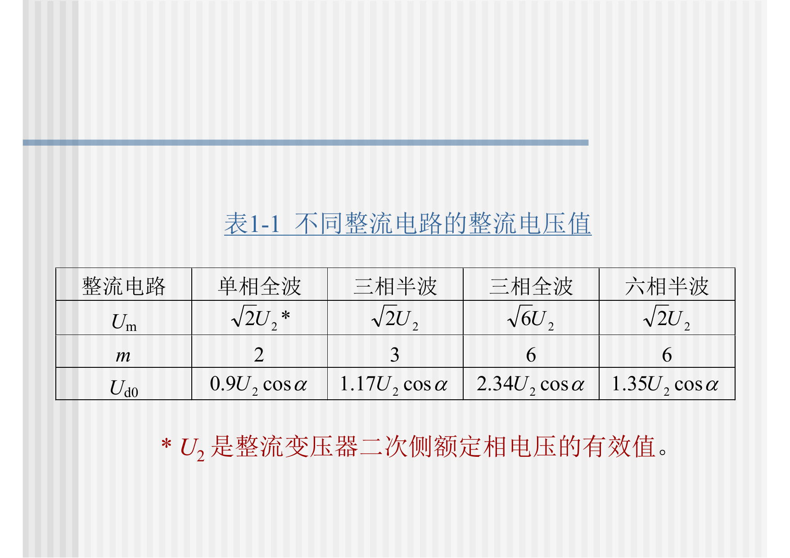
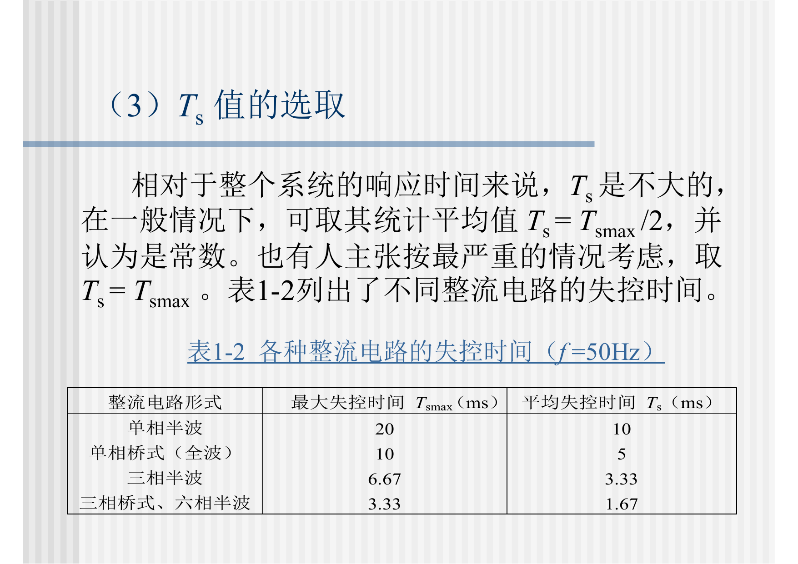
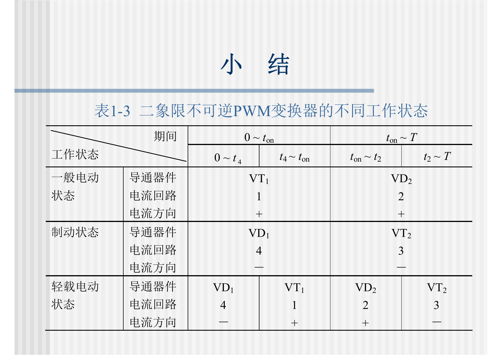
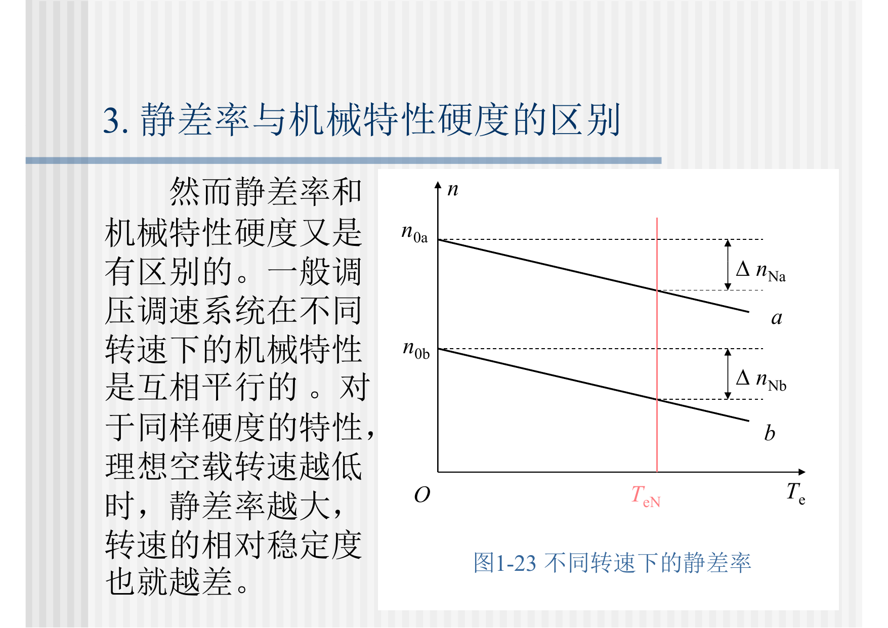
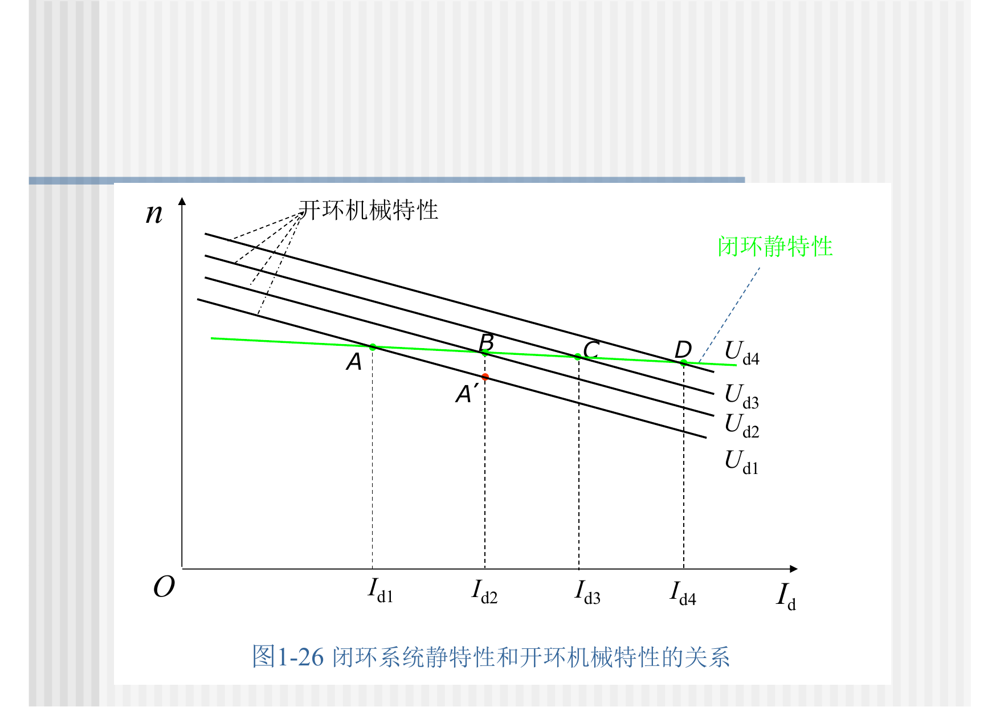
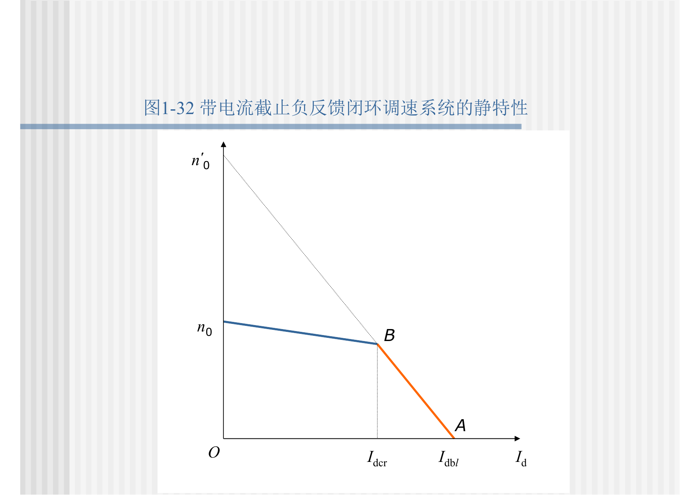
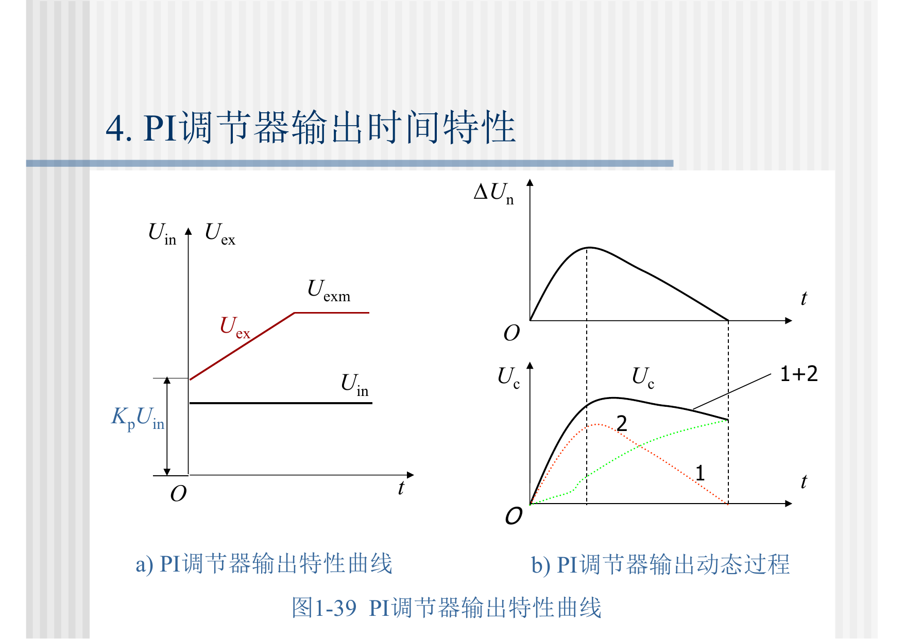

> 本文是根据课程课件与课堂记录整理的复习笔记；原始 PDF 已在“运动控制系统：原始课件”页面提供。页码以本地 PDF 页码为准。

# 第1章：闭环控制的直流调速系统


## 1.0 课件页码与考试重点

| 重要度 | 知识点 | 课件页码 | 复习要求 |
|---|---|---:|---|
| ★★★ | 直流调速方法与调压调速主线 | 第1章 pp. 4-11 | 会由 $n=(U-IR)/(K_e\Phi)$ 推出三种调速方式 |
| ★★☆ | G-M、V-M、PWM 三类可控直流电源 | 第1章 pp. 12-29 | 会比较结构、优缺点和应用场合 |
| ★★★ | V-M 系统主要问题 | 第1章 pp. 30-52 | 掌握整流电压、脉动电流、连续/断续机械特性 |
| ★★★ | PWM 变换器 | 第1章 pp. 63-113 | 会写占空比、平均电压、双极性PWM关系 |
| ★★★ | 调速范围、静差率、额定速降 | 第1章 pp. 118-127 | 高概率计算题 |
| ★★★ | 转速负反馈闭环静特性 | 第1章 pp. 128-152 | 会解释闭环为什么减小速降、扩大调速范围 |
| ★★☆ | 电流截止负反馈 | 第1章 pp. 169-186 | 会说明限流作用和分段静特性 |
| ★★★ | PI 调节器与无静差调速 | 第1章 pp. 244-283 | 会解释 P 有静差、PI 无静差 |

## 1.1 本章主线

本章从“用什么电源调直流电机”开始，逐步进入“如何用反馈改善调速性能”。

1. 直流电机调速以调压调速为主。
2. 可控直流电源有G-M、V-M、PWM三类。
3. 开环调速难以同时满足调速范围和静差率要求。
4. 转速负反馈能减小速降，但比例控制仍有静差。
5. 电流截止负反馈用于限流保护。
6. PI调节器通过积分作用实现稳态无静差。

## 1.2 直流电机调速方程

电枢电压方程：

$$
U=E+IR
$$

反电动势：

$$
E=K_e\Phi n
$$

转速方程：

$$
n=\frac{U-IR}{K_e\Phi}
=\frac{U}{K_e\Phi}-\frac{R}{K_eK_t\Phi^2}T_e
$$

由此推出三种调速：

| 调速方法 | 控制量 | 特点 |
|---|---|---|
| 调压调速 | 改变 $U$ | 机械特性近似平行移动，自动控制主方法 |
| 调阻调速 | 改变 $R$ | 机械特性变软，损耗大 |
| 调磁调速 | 改变 $\Phi$ | 基速以上弱磁升速，转矩能力下降 |

## 1.3 可控直流电源

| 电源类型 | 名称 | 工作方式 | 特点 |
|---|---|---|---|
| G-M系统 | 旋转变流机组 | 交流电机拖动直流发电机，再给直流电机供电 | 可四象限，体积大、效率低、维护多 |
| V-M系统 | 晶闸管-电动机系统 | 用可控整流器改变直流平均电压 | 大容量常用，但有谐波、无功、断续电流等问题 |
| PWM系统 | 直流斩波/PWM变换器 | 用开关器件调节平均电压 | 响应快、效率高、低速性能好 |

## 1.4 V-M系统重点

### 1.4.1 整流电压

晶闸管可控整流通过改变触发角 $\alpha$ 改变整流电压。理想空载整流电压：

$$
U_{d0}=U_{d0\max}\cos\alpha
$$

一般 $m$ 脉波整流电路：

$$
U_{d0}=\frac{m}{\pi}U_m\sin\frac{\pi}{m}\cos\alpha
$$

不同整流电路的 $U_{d0}$ 形式见表1-1，这张表用于判断不同整流电路的平均电压表达式。



考虑等效压降：

$$
U_d=U_{d0}-I_dR_{\mathrm{eq}}-\Delta U
$$

### 1.4.2 V-M系统问题

V-M系统主要问题：

1. 晶闸管单向导电，可逆运行复杂。
2. 对过电压、过电流、$dV/dt$、$di/dt$ 敏感。
3. 相控整流带来谐波和无功功率。
4. 输出电流可能脉动甚至断续。
5. 存在失控时间，动态响应受限制。

失控时间见表1-2，它说明不同整流电路触发后到输出响应之间存在延迟。



### 1.4.3 V-M机械特性

电流连续时，V-M系统机械特性近似为线性：

$$
n=\frac{U_{d0}-I_dR}{C_e\Phi}
$$

电流断续时，机械特性非线性且变软，低速性能变差。因此 V-M 系统常需要平波电抗器来改善电流连续性。

## 1.5 PWM系统重点

### 1.5.1 不可逆PWM

占空比：

$$
\rho=\frac{t_{\mathrm{on}}}{T}
$$

平均输出电压：

$$
U_d=\rho U_s
$$

### 1.5.2 二象限不可逆PWM

二象限不可逆PWM通过双管交替工作提供制动电流通路。表1-3是理解“电动状态、制动状态、电流续流路径”的关键表。



### 1.5.3 桥式可逆PWM

双极性桥式可逆PWM中：

$$
\gamma=2\rho-1
$$

$$
U_d=\gamma U_s=(2\rho-1)U_s
$$

当 $\rho=0.5$ 时 $U_d=0$；当 $\rho>0.5$ 时电压为正；当 $\rho<0.5$ 时电压为负。

PWM系统优点：

1. 主电路简单，功率器件少。
2. 开关频率高，电流连续性好。
3. 低速性能好，调速范围宽。
4. 动态响应快。
5. 器件工作在开关状态，效率高。

## 1.6 静态性能指标

### 1.6.1 调速范围

$$
D=\frac{n_{\max}}{n_{\min}}
$$

### 1.6.2 静差率

$$
s=\frac{\Delta n_N}{n_0}
$$

静差率按最低速考核。同样的额定速降，在低速时相对误差更大。



### 1.6.3 调速范围、静差率、额定速降

最低速理想空载转速：

$$
n_{0\min}=\frac{\Delta n_N}{s}
$$

最低速额定负载转速：

$$
n_{\min}=n_{0\min}-\Delta n_N
=\frac{\Delta n_N}{s}(1-s)
$$

若 $n_{\max}\approx n_N$，则：

$$
D=\frac{n_Ns}{\Delta n_N(1-s)}
$$

结论：

1. 静差率要求越小，允许调速范围越小。
2. 额定速降越大，允许调速范围越小。
3. 要扩大调速范围，必须提高机械特性硬度。

## 1.7 转速负反馈闭环调速

负载增加时，开环系统转速下降；闭环系统会通过反馈自动提高控制电压：

```text
负载增加 -> 转速下降 -> 反馈电压下降 -> 偏差增大 -> 电枢电压增大 -> 转速回升
```

闭环速降近似为：

$$
\Delta n_{\mathrm{cl}}=\frac{\Delta n_{\mathrm{op}}}{1+K}
$$

闭环静特性比开环机械特性硬：

$$
\beta_{\mathrm{cl}}\approx(1+K)\beta_{\mathrm{op}}
$$



反馈控制规律：

1. 比例闭环只能减小静差，不能消除静差。
2. 反馈只能抑制被反馈环包围的前向通道扰动。
3. 给定误差和测速反馈误差不会被同一个反馈环自动消除。

## 1.8 电流截止负反馈

电流截止负反馈用于限流保护。其分段关系可写为：

$$
U_i=
\begin{cases}
0, & I_d\le I_{dcr}\\
\beta(I_d-I_{dcr}), & I_d>I_{dcr}
\end{cases}
$$

作用：

1. 正常电流范围内不影响转速负反馈。
2. 电流超过临界值后接入负反馈，限制电流继续增大。
3. 形成下垂的限流静特性。



注意：电流截止负反馈是被动限流，不能像第2章双闭环那样主动实现恒流起动。

## 1.9 PI调节器与无静差

比例调节器：

$$
U_c=K_p e
$$

稳态带负载运行需要非零控制量，因此必须保留偏差，所以比例系统有静差。

PI调节器：

$$
U_c(t)=K_pe(t)+K_i\int_0^t e(\tau)\,d\tau
$$

传递函数：

$$
W_{\mathrm{PI}}(s)
=K_p+\frac{K_i}{s}
=K_p\frac{\tau s+1}{\tau s}
$$

只要稳态偏差不为零，积分项就继续变化，直到偏差趋近于零。因此PI调节器可以实现稳态无静差。



无静差不是动态过程中没有误差，而是稳态转速偏差可以为零。

## 1.10 本章复习抓手

- 会写直流电机转速方程并推出三种调速方法。
- 会比较G-M、V-M、PWM三类可控直流电源。
- 会看表1-1、表1-2、表1-3，理解V-M和PWM的关键参数。
- 会定义调速范围、静差率，并推导 $D=\frac{n_Ns}{\Delta n_N(1-s)}$。
- 会解释闭环为什么能减小速降、提高静特性硬度。
- 会说明比例控制有静差，PI控制无静差。
- 会说明电流截止负反馈的分段作用和局限。
