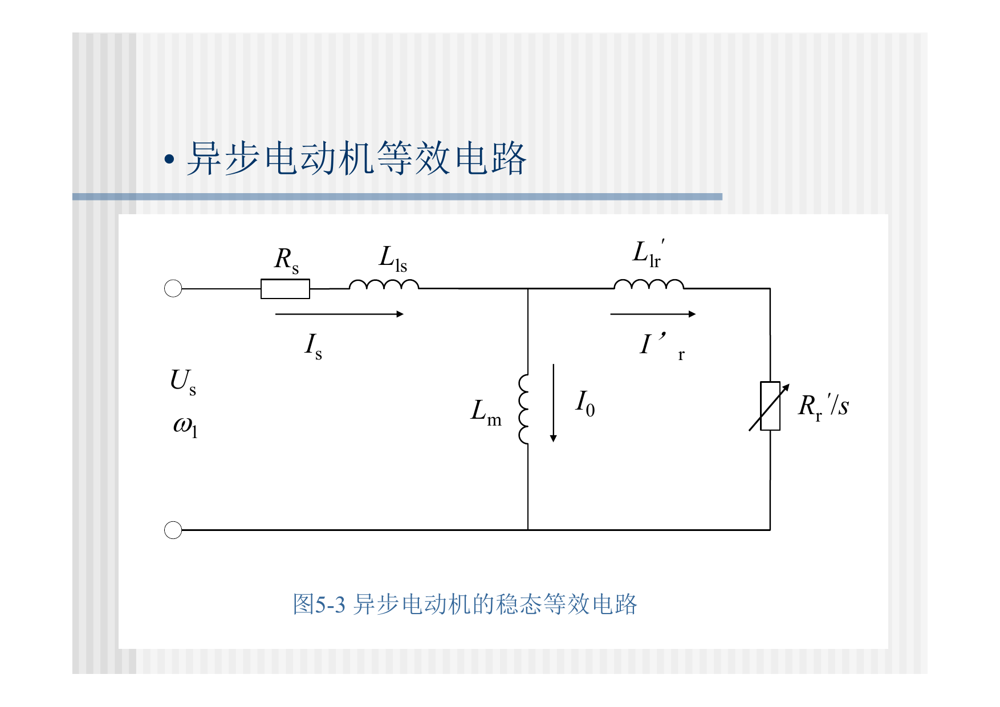
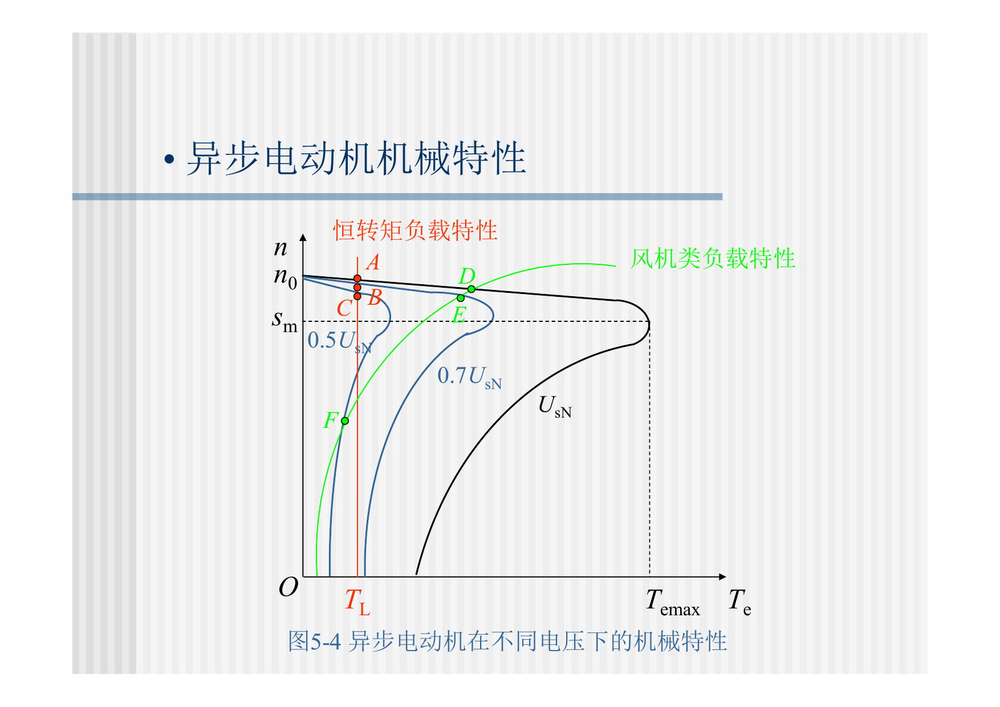
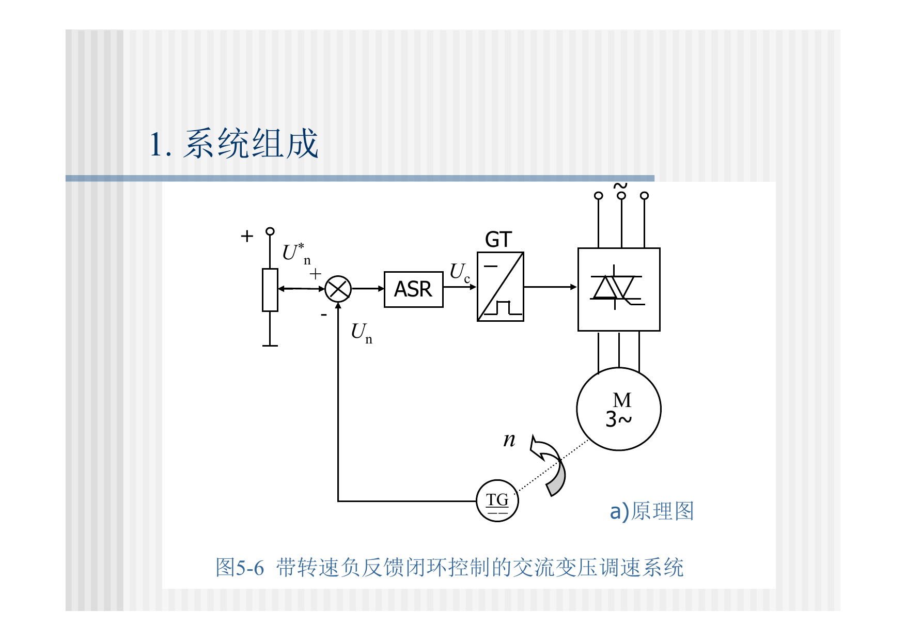
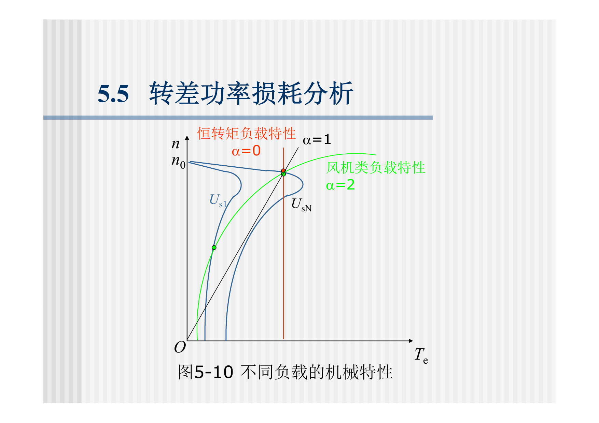
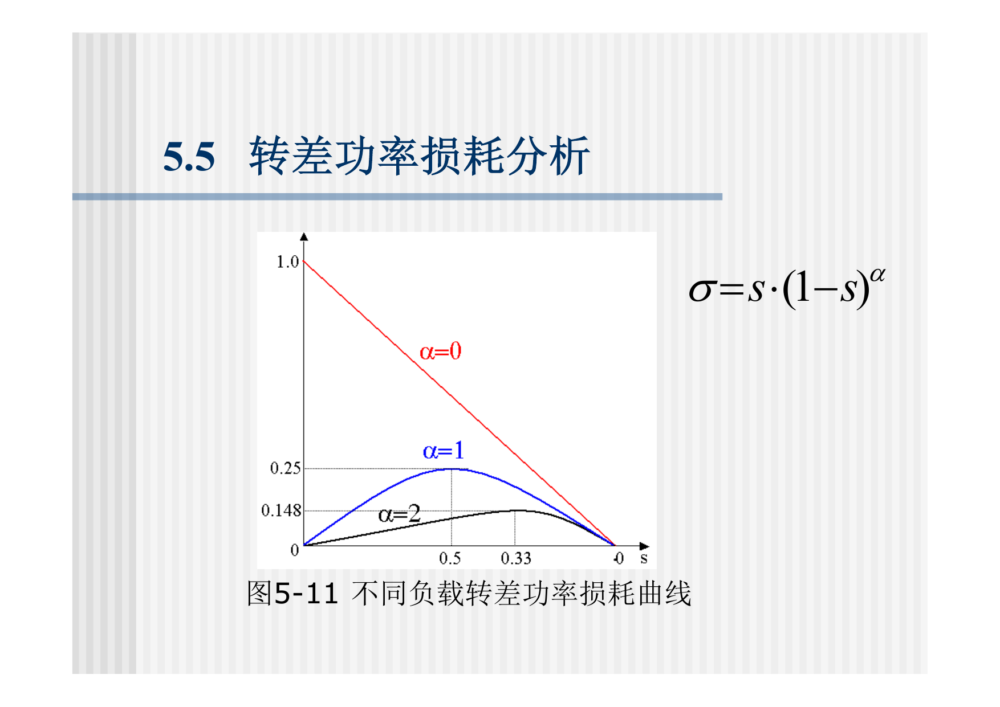
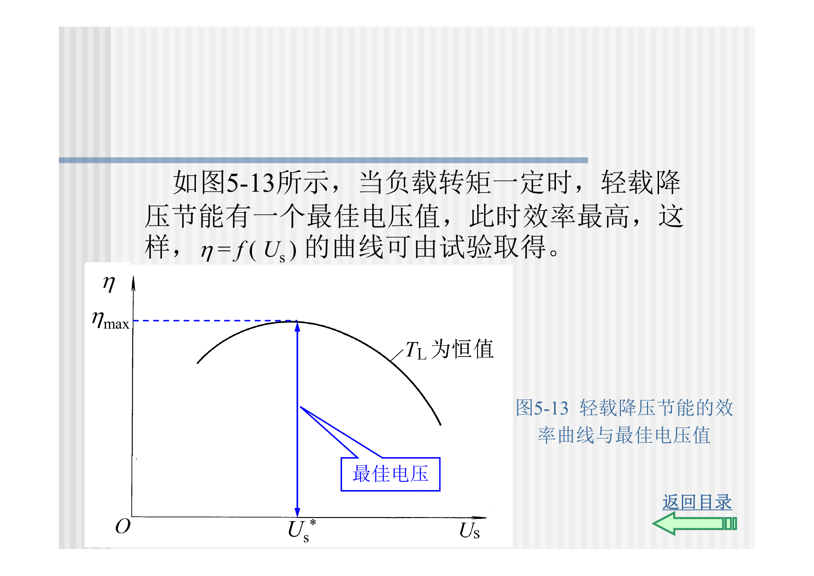

> 本文是根据课程课件与课堂记录整理的复习笔记；原始 PDF 已在“运动控制系统：原始课件”页面提供。页码以本地 PDF 页码为准。

# 第5章：交流拖动控制系统

## 5.0 课件页码与考试重点

| 重要度 | 知识点 | 课件页码 | 复习要求 |
|---|---|---:|---|
| ★★☆ | 交流调速背景与应用领域 | 第5章 pp. 3-12 | 会解释交流电机优势和交流调速应用 |
| ★★★ | 交流调速按转差功率分类 | 第5章 pp. 21-28 | 必会三类：消耗型、馈送型、不变型 |
| ★★★ | 异步电机变压调速原理 | 第5章 pp. 31-42 | 知道它属于转差功率消耗型 |
| ★★★ | 改变电压时机械特性 | 第5章 pp. 42-53 | 会说明 $T_{\max}\propto U_s^2$ |
| ★★☆ | 闭环变压调速静特性 | 第5章 pp. 54-63 | 会说明闭环能改善静特性，但不能改变效率问题 |
| ★★☆ | 近似动态结构与线性化 | 第5章 pp. 64-83 | 了解非线性系统需在工作点附近线性化 |
| ★★★ | 转差功率损耗分析 | 第5章 pp. 84-87 | 会解释为什么降压调速低速效率低 |
| ★★☆ | 软起动与轻载降压节能 | 第5章 pp. 88-105 | 了解工程应用 |

## 5.1 本章主线

第5章是从直流调速过渡到交流调速的桥梁，核心不是复杂控制算法，而是理解交流调速的分类、效率本质和变压调速的局限。

复习顺序：

1. 交流电机为什么值得调速。
2. 异步电机转速公式说明有哪些调速路径。
3. 按转差功率把交流调速分成三类。
4. 变压调速改变定子电压，最大转矩按电压平方下降。
5. 闭环可以改善静特性，但不能改变转差功率消耗型本质。
6. 软起动、轻载降压节能是变压控制的工程应用。

## 5.2 交流调速背景

直流电机调速性能好，但有电刷和换向器，维护量大，容量、电压和转速上限受限制。交流电机结构简单、成本低、可靠性高、维护方便，更适合大容量和恶劣环境。

交流调速发展依赖：

1. 电力电子器件。
2. 微机数字控制。
3. PWM变频器。
4. 矢量控制和直接转矩控制。

## 5.3 异步电机调速基本关系

同步转速：

$$
n_0=\frac{60f_1}{n_p}
$$

实际转速：

$$
n=(1-s)n_0
$$

即：

$$
n=(1-s)\frac{60f_1}{n_p}
$$

由此看出异步电机调速方法：

1. 改变 $f_1$：变频调速。
2. 改变 $n_p$：变极调速。
3. 改变 $s$：降压、转子串电阻、串级调速等。

## 5.4 按转差功率分类

气隙功率为 $P_{\mathrm{em}}$，转子铜耗为：

$$
P_{\mathrm{Cu2}}=sP_{\mathrm{em}}
$$

机械功率为：

$$
P_m=(1-s)P_{\mathrm{em}}
$$

转差功率：

$$
P_s=sP_{\mathrm{em}}
$$

分类表：

| 类型 | 转差功率处理 | 代表方法 | 效率特点 |
|---|---|---|---|
| 转差功率消耗型 | 转差功率主要变热 | 降压调速、转子串电阻、转差离合器 | 低速效率低 |
| 转差功率馈送型 | 转差功率回馈或利用 | 串级调速、双馈调速 | 效率较高，系统复杂 |
| 转差功率不变型 | 不靠增大转差调速 | 变极、变压变频 | 效率高，VVVF最重要 |

考试常问：降压调速为什么低效？因为它靠增大转差来降速，$P_s=sP_{\mathrm{em}}$ 增大，并且主要消耗为热。

## 5.5 异步电机变压调速

变压调速保持电源频率不变，改变定子电压 $U_s$，从而改变机械特性。

异步电机稳态等效电路是机械特性公式的来源。

电磁转矩可写成：

$$
T_e=
\frac{3n_p}{\omega_1}
\cdot
\frac{U_s^2(R_r'/s)}
{\left(R_s+R_r'/s\right)^2+\left(X_s+X_r'\right)^2}
$$

频率不变、参数近似不变时：

$$
T_e\propto U_s^2
$$

最大转矩也近似满足：

$$
T_{\max}\propto U_s^2
$$

因此降压会显著降低转矩能力。

结论：

1. 普通笼型异步电机变压调速范围窄。
2. 恒转矩负载下，降压后很容易带不动。
3. 风机泵类负载低速转矩要求下降，更适合变压或变频节能。
4. 高转子电阻交流力矩电机可扩大变压调速范围，但效率低。

## 5.6 闭环变压调速

加转速负反馈可以改善变压调速系统的静特性。

闭环系统能做到：

1. 在一定范围内使静特性变硬。
2. 减小负载扰动造成的转速变化。
3. 扩大可用调速范围。

但要注意：

1. 异步电机机械特性非线性明显。
2. 闭环静特性受额定电压和最小输出电压边界限制。
3. 闭环不能改变降压调速属于转差功率消耗型的本质。

## 5.7 近似动态结构与线性化

变压调速系统是非线性的，因为 $T_e$ 同时与电压、转速、转差率相关。工程上常在某个稳态工作点附近线性化：

$$
\Delta T_e
\approx
\left.\frac{\partial T_e}{\partial U_s}\right|_0\Delta U_s
+
\left.\frac{\partial T_e}{\partial n}\right|_0\Delta n
$$

线性化的意义：在小扰动范围内，把非线性机械特性近似成线性环节，便于画动态结构图和分析闭环性能。

## 5.8 转差功率损耗分析

不同负载的机械特性会影响低速时的转差功率损耗。

转差功率与最大输出功率之比可用于衡量低速损耗。课件给出的不同负载转差功率损耗曲线说明：转差功率消耗型调速低速效率明显变差。

复习结论：

1. 降压调速低速效率低。
2. 风机泵类负载低速所需功率下降，节能价值更明显。
3. 宽范围高效调速应优先考虑变压变频调速。

## 5.9 软起动与轻载降压节能

### 5.9.1 软起动

异步电机直接起动电流大，降压起动能减小冲击电流。但起动转矩也随电压平方下降：

$$
T_{\mathrm{st}}\propto U_s^2
$$

所以软起动适合降低冲击，但电压不能降得过低，否则起动转矩不足。

### 5.9.2 轻载降压节能

轻载时负载转矩小，可适当降低定子电压以减少励磁相关损耗。但电压过低又会导致电流增大、铜耗上升，因此存在最佳电压。

## 5.10 本章复习抓手

- 会写 $n=(1-s)60f_1/n_p$ 并推出三类调速路径。
- 会按转差功率分为消耗型、馈送型、不变型。
- 会解释降压调速为什么是转差功率消耗型。
- 会写 $T_e\propto U_s^2$，并解释降压后转矩能力下降。
- 会说明闭环变压调速能改善静特性，但不能解决低速效率问题。
- 会结合图5-11解释低速转差功率损耗。
- 了解软起动和轻载降压节能的适用边界。
