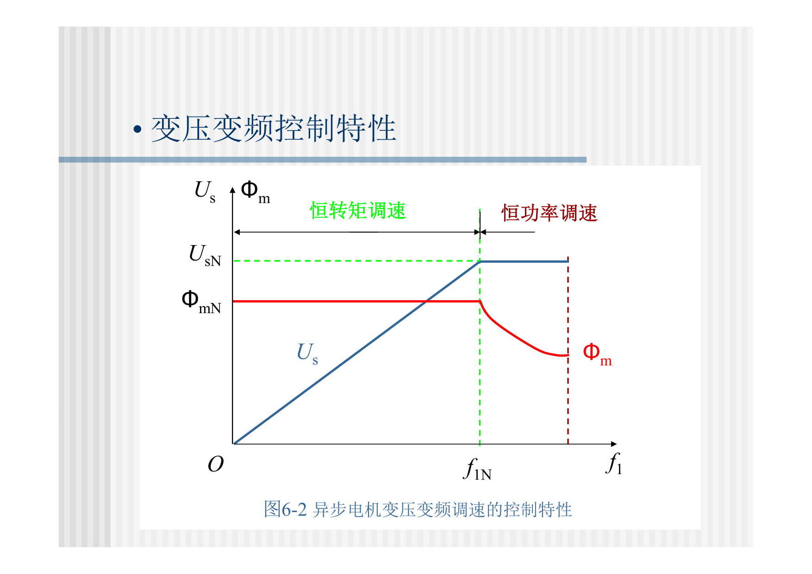
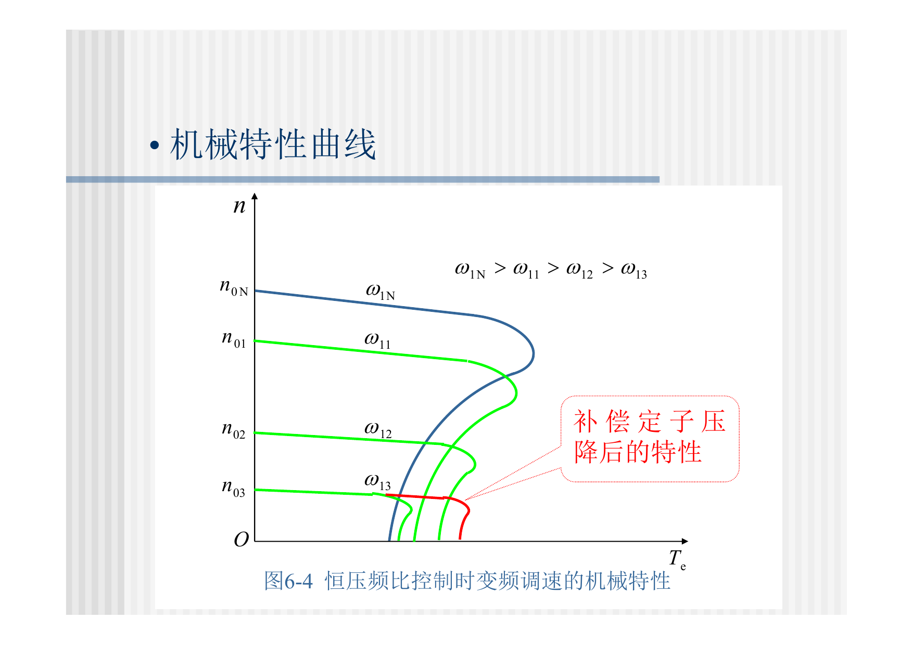
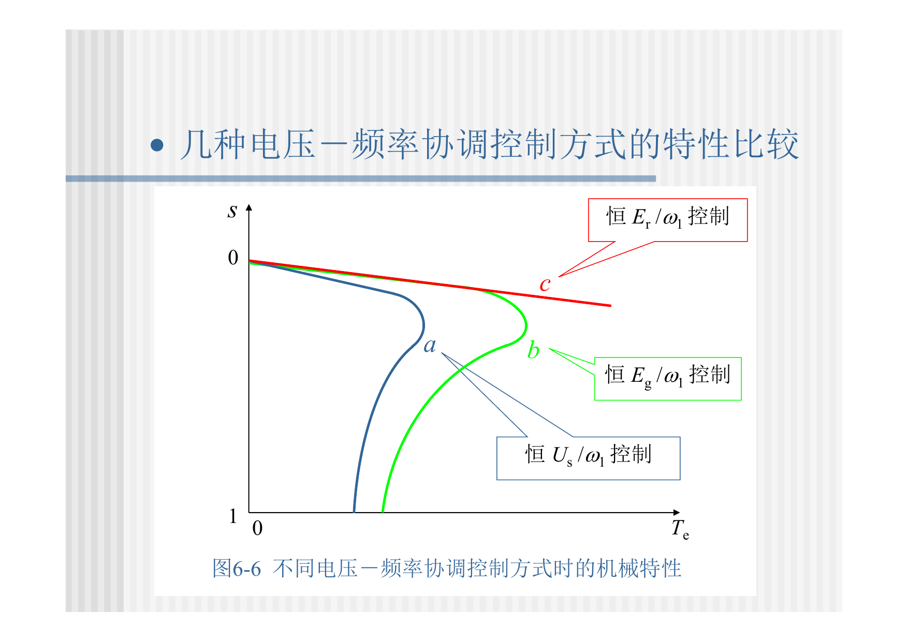
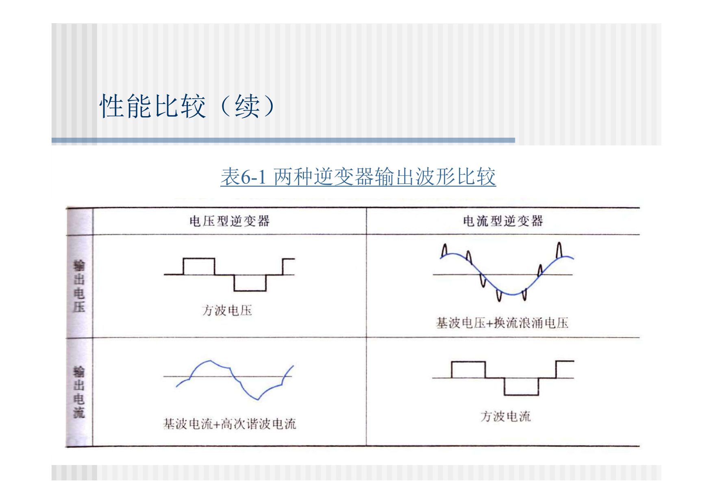
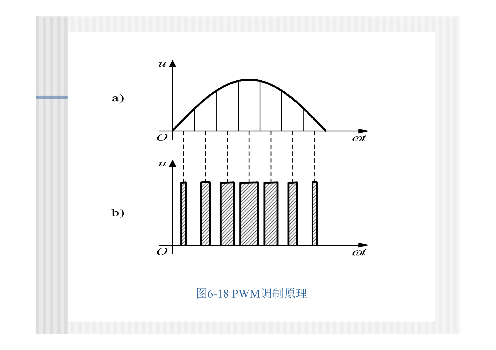
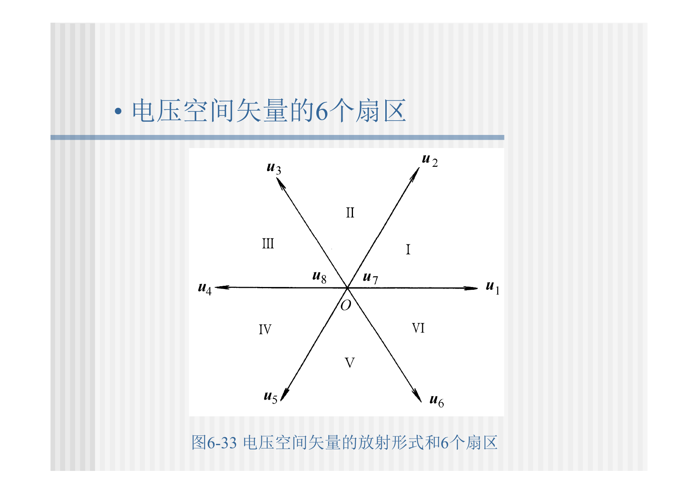
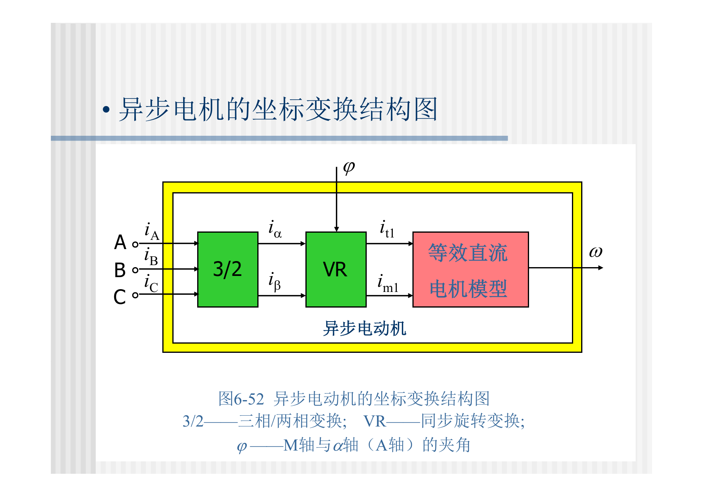
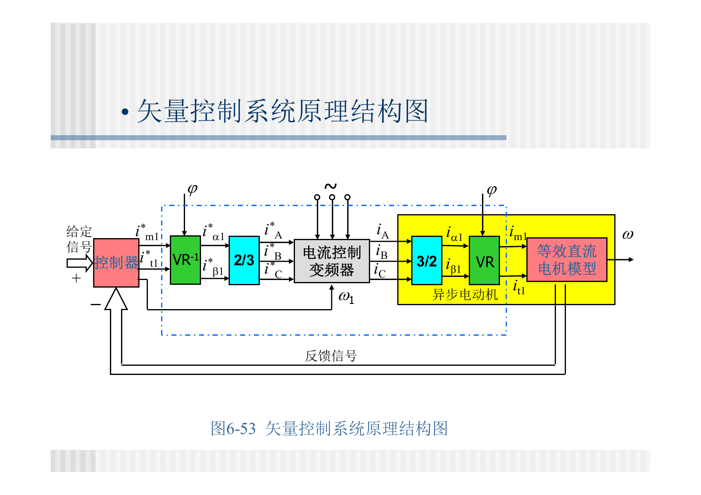
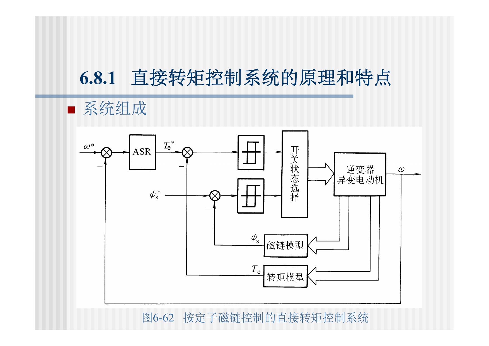
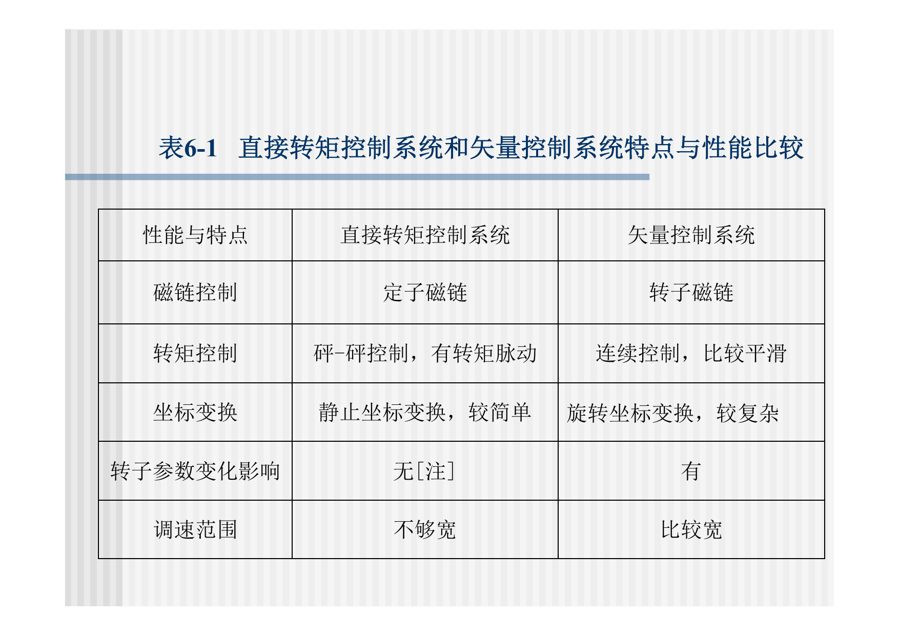

> 本文是根据课程课件与课堂记录整理的复习笔记；原始 PDF 已在“运动控制系统：原始课件”页面提供。页码以本地 PDF 页码为准。

# 第6章：笼型异步电机变压变频调速系统


## 6.0 课件页码与考试重点

| 重要度 | 知识点 | 课件页码 | 复习要求 |
|---|---|---:|---|
| ★★★ | 变压变频基本控制方式 | 第6章 pp. 4-14 | 会说明为什么变频必须变压、为什么要保持磁通 |
| ★★★ | 基频以下/以上控制规律 | 第6章 pp. 8-14, 46-49 | 必会：基频以下恒转矩，基频以上弱磁恒功率 |
| ★★★ | 电压-频率协调控制机械特性 | 第6章 pp. 20-45 | 会比较恒 $U_s/\omega_1$、恒 $E_g/\omega_1$、恒 $E_r/\omega_1$ |
| ★★☆ | 变频器类型 | 第6章 pp. 61-90 | 会区分交-直-交、交-交，电压源型/电流源型 |
| ★★★ | SPWM、CHBPWM、SVPWM | 第6章 pp. 115-219 | 会说出各自思想，SVPWM要会看空间矢量图 |
| ★★★ | 转差频率控制 | 第6章 pp. 238-263 | 会说明控制转差频率代表控制转矩 |
| ★★★ | 动态模型与坐标变换 | 第6章 pp. 266-390 | 会解释坐标变换是为了把交流量“直流化” |
| ★★★ | 矢量控制 | 第6章 pp. 391-442 | 会解释转子磁链定向、励磁分量/转矩分量解耦 |
| ★★★ | 直接转矩控制DTC | 第6章 pp. 443-469 | 会比较DTC与矢量控制 |

## 6.1 本章主线

第6章是交流调速的核心。它从最基本的恒压频比控制出发，逐步走向高性能交流控制：

1. 变频调速必须协调变压，以保持磁通合适。
2. 基频以下恒磁通、恒转矩；基频以上弱磁、恒功率。
3. 电压-频率协调方式不同，机械特性不同。
4. PWM变频器实现可变电压、可变频率交流输出。
5. 转差频率控制利用稳态模型改善动态性能。
6. 坐标变换把三相交流模型变成类似直流模型。
7. 矢量控制按转子磁链定向，实现磁链和转矩解耦。
8. DTC直接控制定子磁链和电磁转矩，结构更直接。

## 6.2 变压变频的磁通控制

气隙电动势：

$$
E_g=4.44f_1N_sk_{N_s}\Phi_m
$$

气隙磁通：

$$
\Phi_m=\frac{E_g}{4.44f_1N_sk_{N_s}}
$$

若希望磁通保持额定，应保持：

$$
\frac{E_g}{f_1}=\mathrm{constant}
$$

工程中 $E_g$ 难直接测量，常用定子电压近似：

$$
\frac{U_s}{f_1}\approx \mathrm{constant}
$$

低频时定子电阻压降不可忽略：

$$
U_s\approx E_g+I_sR_s+jX_sI_s
$$

因此低频要做电压补偿。



## 6.3 基频以下与基频以上

| 区域 | 控制规律 | 磁通 | 调速性质 |
|---|---|---|---|
| 基频以下 | $U_s/f_1$ 近似恒定 | 近似恒磁通 | 恒转矩调速 |
| 基频以上 | $U_s=U_{sN}$，$f_1$ 继续升高 | 弱磁 | 恒功率调速 |

机械功率：

$$
P=T\omega
$$

基频以下 $T\approx \mathrm{constant}$，功率随转速升高；基频以上 $P\approx \mathrm{constant}$，转矩随转速升高而下降。

## 6.4 电压-频率协调控制机械特性

### 6.4.1 恒 $U_s/\omega_1$ 控制

恒压频比最容易实现：

$$
\frac{U_s}{\omega_1}=\mathrm{constant}
$$

机械特性基本平行下移，但低频时定子电阻压降影响明显，需要补偿。



### 6.4.2 恒 $E_g/\omega_1$ 控制

恒气隙电动势频比：

$$
\frac{E_g}{\omega_1}=\mathrm{constant}
$$

这比恒 $U_s/\omega_1$ 更接近恒气隙磁通，稳态性能更好，但 $E_g$ 不易直接测量。

### 6.4.3 恒 $E_r/\omega_1$ 控制

恒转子电动势频比可使机械特性更接近直流电机的线性特性，是矢量控制追求的目标。

三种协调方式的对比见图6-6。



记忆：

1. 恒 $U_s/\omega_1$：最简单，低频性能差。
2. 恒 $E_g/\omega_1$：更接近恒气隙磁通。
3. 恒 $E_r/\omega_1$：机械特性最好，是矢量控制目标。

## 6.5 变频器类型

### 6.5.1 交-直-交变频器

结构：

```text
交流电源 -> 整流器 -> 直流中间环节 -> 逆变器 -> 可变频交流输出
```

现代通用变频器多采用交-直-交PWM结构，应用最广。

### 6.5.2 交-交变频器

交-交变频器直接把固定频率交流变为可调频率交流，无直流中间环节，适合大功率低速场合，但输出频率受电网频率限制。

### 6.5.3 电压源型与电流源型

电压源型中间直流环节为大电容，近似恒压源；电流源型中间直流环节为大电感，近似恒流源。

课件表6-1给出了两类逆变器输出波形比较。



## 6.6 PWM技术

PWM目的：调节输出基波电压和频率，同时减少低次谐波，改善电流波形和转矩脉动。

### 6.6.1 SPWM

SPWM用正弦调制波与三角载波比较，生成脉宽按正弦规律变化的开关序列。

调制比：

$$
m_a=\frac{U_{\mathrm{ref}}}{U_{\mathrm{carrier}}}
$$

频率比：

$$
m_f=\frac{f_c}{f_1}
$$

在线性调制区：

$$
U_1\propto m_aU_d
$$



### 6.6.2 CHBPWM

电流滞环跟踪PWM直接让实际电流跟随给定电流。偏差触及滞环边界时切换开关状态。

优点：电流响应快。缺点：开关频率不固定。

### 6.6.3 SVPWM

SVPWM从空间电压矢量角度出发，用基本电压矢量合成目标矢量。

三相两电平逆变器有：

$$
2^3=8
$$

个开关状态，其中6个非零矢量、2个零矢量。每个采样周期：

$$
\vec U_{\mathrm{ref}}T_s
=\vec U_1T_1+\vec U_2T_2+\vec U_0T_0
$$

并且：

$$
T_s=T_1+T_2+T_0
$$



SVPWM重点：

1. 用相邻两个有效矢量和零矢量合成参考矢量。
2. 直流电压利用率高于SPWM。
3. 适合数字控制。
4. 与矢量控制和DTC联系紧密。

## 6.7 转差频率控制

异步电机同步角速度与转子角速度、转差角速度关系：

$$
\omega_1=\omega+\omega_s
$$

转差频率：

$$
f_s=sf_1
$$

在保持磁通恒定时，转差频率可以代表转矩控制。转差频率控制规律：

1. 根据转速给定和实测转速形成转差频率给定。
2. 用 $\omega_1=\omega+\omega_s$ 得到定子频率。
3. 按磁通恒定要求确定电压。

局限：它仍基于稳态模型，动态过程中不能完全解耦磁链和转矩。

## 6.8 坐标变换

坐标变换的目的：把三相交流量变换为两相静止量，再变换为同步旋转坐标中的近似直流量，从而降低模型复杂度。



Clarke变换：

$$
\begin{bmatrix}
i_\alpha\\
i_\beta
\end{bmatrix}
=
\frac{2}{3}
\begin{bmatrix}
1 & -\frac{1}{2} & -\frac{1}{2}\\
0 & \frac{\sqrt{3}}{2} & -\frac{\sqrt{3}}{2}
\end{bmatrix}
\begin{bmatrix}
i_a\\
i_b\\
i_c
\end{bmatrix}
$$

Park变换：

$$
\begin{bmatrix}
i_d\\
i_q
\end{bmatrix}
=
\begin{bmatrix}
\cos\theta & \sin\theta\\
-\sin\theta & \cos\theta
\end{bmatrix}
\begin{bmatrix}
i_\alpha\\
i_\beta
\end{bmatrix}
$$

同步旋转坐标系的突出特点：三相正弦交流电压、电流变换到$dq$坐标系后可成为直流量，便于使用PI调节器。

## 6.9 矢量控制

矢量控制的基本思想：通过坐标变换，把异步电机等效为类似直流电机的控制结构。



按转子磁链定向时：

$$
\psi_{rq}=0,\qquad \psi_r=\psi_{rd}
$$

定子电流分解为：

| 分量 | 作用 | 类比直流电机 |
|---|---|---|
| $i_{sd}$ 或 $i_{sm}$ | 控制转子磁链 | 励磁电流 |
| $i_{sq}$ 或 $i_{st}$ | 控制电磁转矩 | 电枢电流 |

转矩关系：

$$
T_e=K_T\psi_ri_{sq}
$$

若 $\psi_r$ 保持恒定：

$$
T_e\propto i_{sq}
$$

这就是“交流电机像直流电机一样控制”的本质。

矢量控制分类：

1. 直接矢量控制：估算或检测转子磁链，磁链闭环。
2. 间接矢量控制：利用转差频率公式实现磁场定向，不直接检测磁链。

## 6.10 直接转矩控制DTC

DTC直接控制定子磁链和电磁转矩，不再先分解定子电流。



定子磁链估算：

$$
\psi_{s\alpha}=\int(u_{s\alpha}-R_si_{s\alpha})\,dt
$$

$$
\psi_{s\beta}=\int(u_{s\beta}-R_si_{s\beta})\,dt
$$

磁链幅值：

$$
|\psi_s|=\sqrt{\psi_{s\alpha}^2+\psi_{s\beta}^2}
$$

电磁转矩：

$$
T_e=\frac{3}{2}n_p(\psi_{s\alpha}i_{s\beta}-\psi_{s\beta}i_{s\alpha})
$$

## 6.11 DTC与矢量控制对比

课件表6-1给出了DTC和矢量控制的特点比较，是第6章后半部分的重点表。



| 项目 | DTC | 矢量控制 |
|---|---|---|
| 控制对象 | 定子磁链和电磁转矩 | 转子磁链定向下的电流分量 |
| 坐标变换 | 静止坐标变换，较简单 | 旋转坐标变换，较复杂 |
| 动态响应 | 很快 | 快 |
| 转矩脉动 | 较大 | 较小 |
| 主要问题 | 低速磁链估算、转矩脉动 | 参数敏感、结构复杂 |

## 6.12 本章复习抓手

- 会解释为什么变频必须变压：保持磁通不过弱、不过饱和。
- 会区分基频以下恒转矩、基频以上恒功率。
- 会比较恒 $U_s/f$、恒 $E_g/f$、恒 $E_r/f$ 控制。
- 会说明电压源型和电流源型逆变器区别。
- 会说清SPWM、CHBPWM、SVPWM的基本思想。
- 会看SVPWM六扇区图，理解基本矢量合成。
- 会写Clarke/Park变换的作用。
- 会解释矢量控制中励磁分量和转矩分量解耦。
- 会写DTC磁链和转矩估算公式。
- 会根据表6-1比较DTC和矢量控制。
