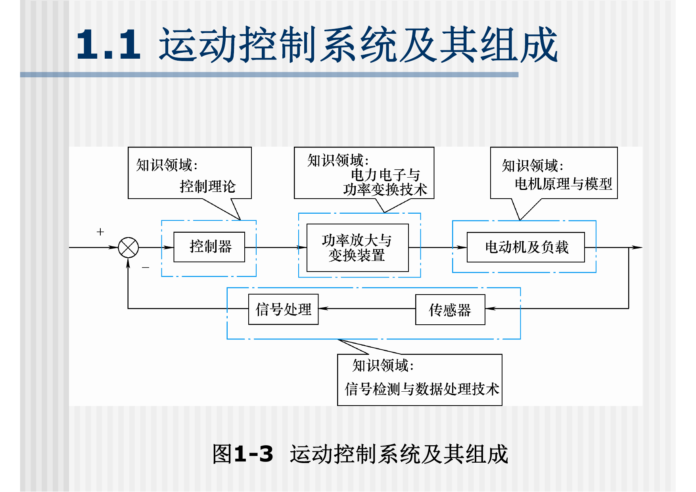
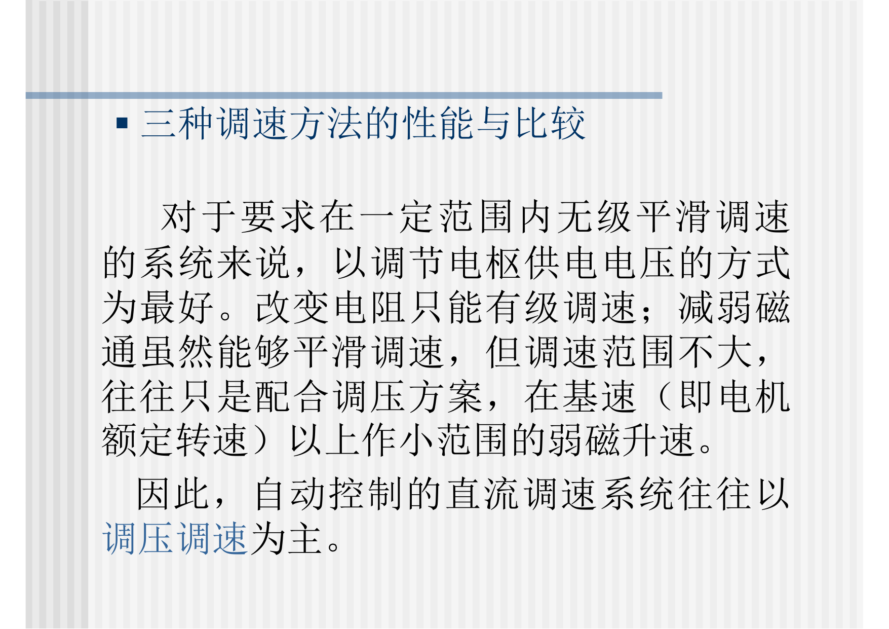
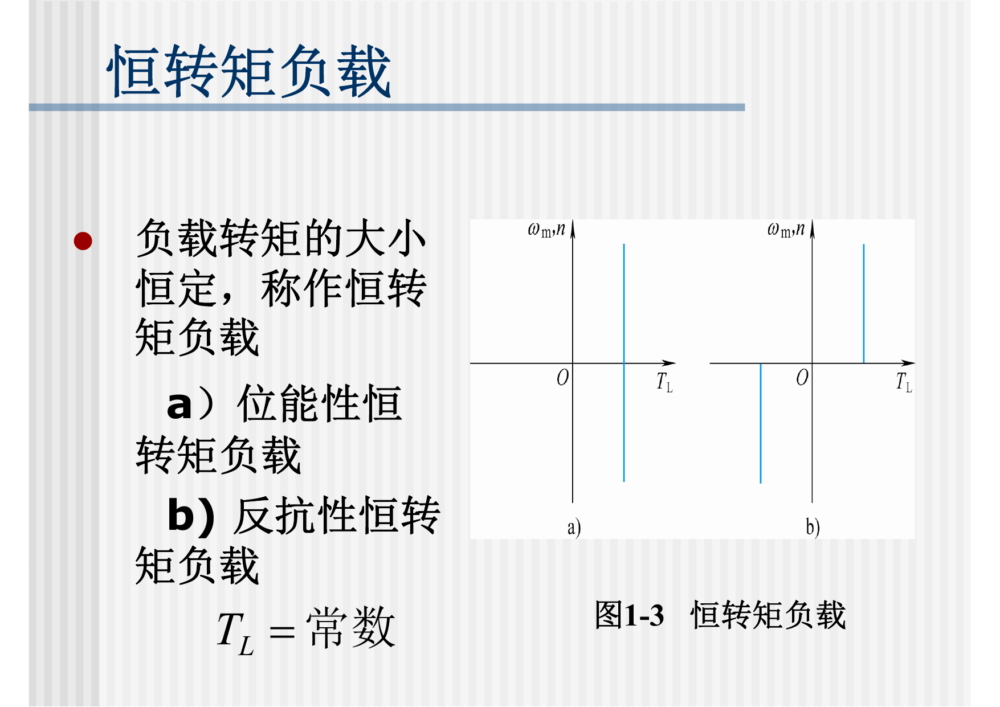
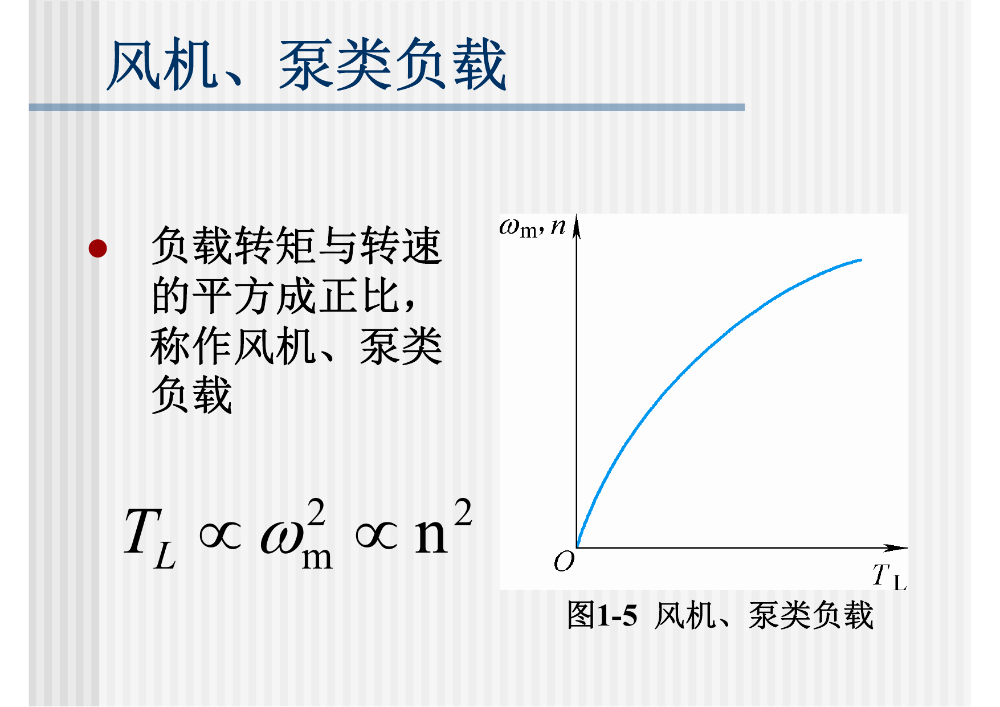
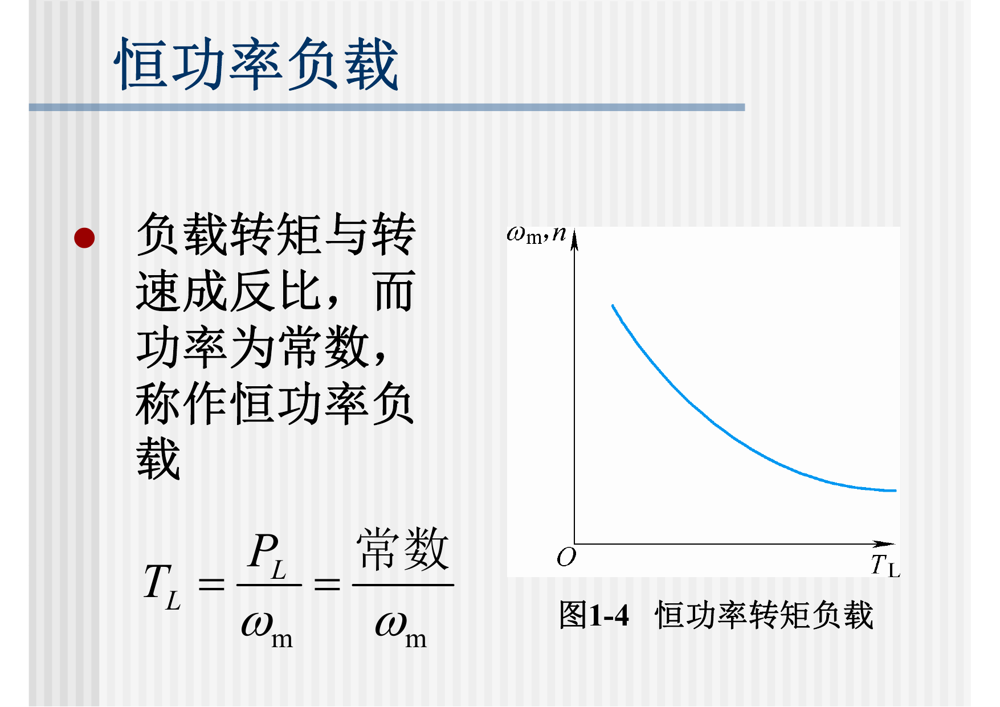

> 本文是根据课程课件与课堂记录整理的复习笔记；原始 PDF 已在“运动控制系统：原始课件”页面提供。页码以本地 PDF 页码为准。

# 绪论：课程安排与运动控制概述

## 0.0 课件页码与考试重点

| 重要度 | 知识点 | 课件页码 | 复习要求 |
|---|---|---:|---|
| ★★★ | 运动控制系统定义、组成与功能 | 绪论 pp. 7-10 | 能用“电动机 + 控制器 + 电力电子变换装置 + 检测反馈”完整描述系统 |
| ★★☆ | 运动控制系统分类 | 绪论 p. 11 | 会按被控量、电机类型、控制器类型、闭环数分类 |
| ★★☆ | 运动控制发展历史与趋势 | 绪论 pp. 12-17 | 能解释交流化、高频化、网络化趋势 |
| ★★★ | 直流调速三种方法 | 绪论 pp. 24-27 | 会由转速方程推出调压、调阻、调磁，并说明调压是主方法 |
| ★★☆ | 典型负载特性 | 绪论 pp. 29-31 | 会区分恒转矩、风机泵类、恒功率负载 |

## 0.1 本课知识结构

运动控制系统研究的不是单台电机，而是由电机、电力电子变换装置、控制器、检测反馈和机械负载组成的自动控制系统。

复习主线：

1. 绪论：系统组成、调速方法、负载特性。
2. 第1章：直流单闭环调速，重点是静差率、闭环静特性、PI无静差。
3. 第2章：直流双闭环调速，重点是ASR/ACR、起动三阶段、工程设计表格。
4. 第5章：交流调速分类和变压调速，重点是转差功率。
5. 第6章：变压变频调速，重点是VVVF、PWM、坐标变换、矢量控制、DTC。

## 0.2 运动控制系统定义

运动控制系统是以机械运动的驱动设备--电动机为被控对象，以控制器为核心，以电力电子功率变换装置为执行机构，在自动控制理论指导下组成的自动控制系统。

主要控制量：

1. 转矩：决定加速度和带载能力。
2. 转速：调速系统的主要被控量。
3. 转角或位移：伺服系统的主要被控量。

抽象成负反馈控制关系：

$$
e(t)=r(t)-y_f(t)
$$

$$
u(t)=C[e(t)]
$$

$$
y(t)=G[u(t),d(t)]
$$

调速系统中：

$$
y(t)=n(t)
$$

伺服系统中：

$$
y(t)=\theta(t)\quad \mathrm{or}\quad x(t)
$$

## 0.3 运动控制系统分类

| 分类方式 | 类型 | 说明 |
|---|---|---|
| 按被控物理量 | 调速系统、伺服系统 | 调速控转速，伺服控角位移或直线位移 |
| 按驱动电机 | 直流控制系统、交流控制系统 | 本课两条主线 |
| 按控制器类型 | 模拟控制系统、数字控制系统 | 现代系统多为数字控制 |
| 按闭环数 | 单环、双环、多环系统 | 双闭环是直流调速核心结构 |

考试常问：为什么先讲直流、再讲交流？因为直流电机转矩与电流、磁通关系清楚，便于建立闭环和多环控制思想；交流电机是工程主流，但模型更复杂，需要电力电子和坐标变换等技术支撑。

## 0.4 直流调速方法

直流电机基本方程：

$$
U=E+IR
$$

$$
E=K_e\Phi n
$$

所以：

$$
n=\frac{U-IR}{K_e\Phi}
$$

由此推出三种调速方法：

| 方法 | 改变量 | 调速方向 | 机械特性 | 结论 |
|---|---|---|---|---|
| 调压调速 | 电枢电压 $U$ | 基速以下降速 | 近似平行移动，硬度基本不变 | 自动控制直流调速主方法 |
| 调阻调速 | 电枢回路电阻 $R$ | 降速 | 机械特性变软 | 损耗大、有级、不适合高性能 |
| 调磁调速 | 励磁磁通 $\Phi$ | 基速以上升速 | 转矩能力下降 | 常与调压配合 |

## 0.5 典型负载特性

负载特性决定调速系统是否合适，是绪论里最容易和后面章节联系起来的内容。

### 0.5.1 恒转矩负载

恒转矩负载满足：

$$
T_L=\mathrm{constant}
$$

机械功率：

$$
P=T_L\omega
$$

所以：

$$
P\propto n
$$

典型对象：起重、轧机、输送带。

### 0.5.2 风机、泵类负载

风机、泵类负载常近似满足：

$$
T_L\propto n^2
$$

因为：

$$
P=T_L\omega,\qquad \omega\propto n
$$

所以：

$$
P\propto n^3
$$

这解释了为什么风机、水泵特别适合变频节能：转速稍微降低，功率会按近似三次方下降。

### 0.5.3 恒功率负载

恒功率负载满足：

$$
P=\mathrm{constant}
$$

因此：

$$
T_L=\frac{P}{\omega}\propto \frac{1}{n}
$$

典型对象：卷绕系统、机床主轴弱磁区。

## 0.6 直流与交流调速对照

| 对照项 | 直流调速 | 交流调速 |
|---|---|---|
| 控制难度 | 转矩与电流关系清晰，控制较直接 | 多变量、强耦合、非线性 |
| 执行装置 | 可控整流器、PWM斩波器 | 交流调压器、变频器 |
| 高频考点 | 闭环静特性、PI、双闭环 | 转差功率、VVVF、PWM、矢量控制 |
| 工程趋势 | 受换向器限制 | 结构简单可靠，是现代主流 |

交流调速兴起的原因：

1. 电力电子器件发展，使可变频、可变压电源成为可能。
2. 微处理器和数字控制使复杂算法可实现。
3. 矢量控制和直接转矩控制改善了交流电机动态性能。
4. 交流电机结构简单、维护少、容量和转速上限高。

## 0.7 本章复习抓手

- 会完整说出运动控制系统的定义、组成和功能。
- 会按被控量、电机类型、控制器类型、闭环数分类。
- 会由 $n=(U-IR)/(K_e\Phi)$ 推出三种直流调速方法。
- 会说明调压调速为什么是直流自动调速主方法。
- 会区分恒转矩、风机泵类、恒功率三类负载。
- 会解释为什么交流调速逐渐替代很多直流调速场合。
